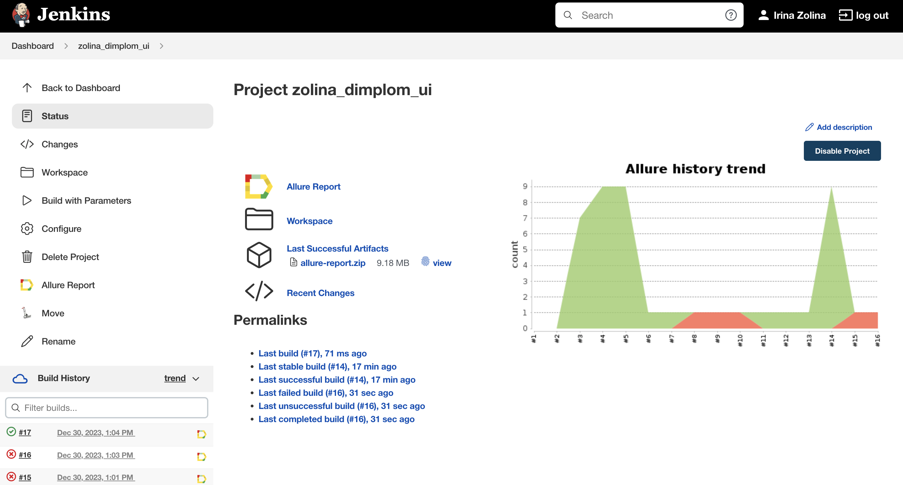
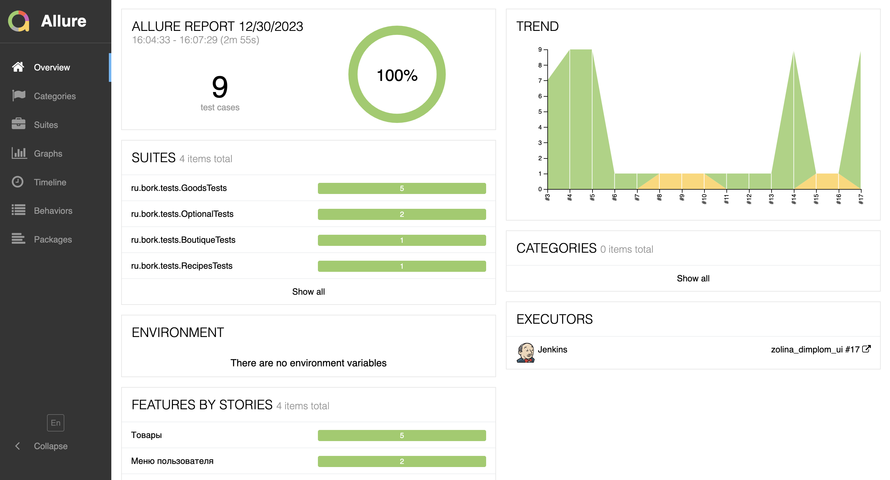
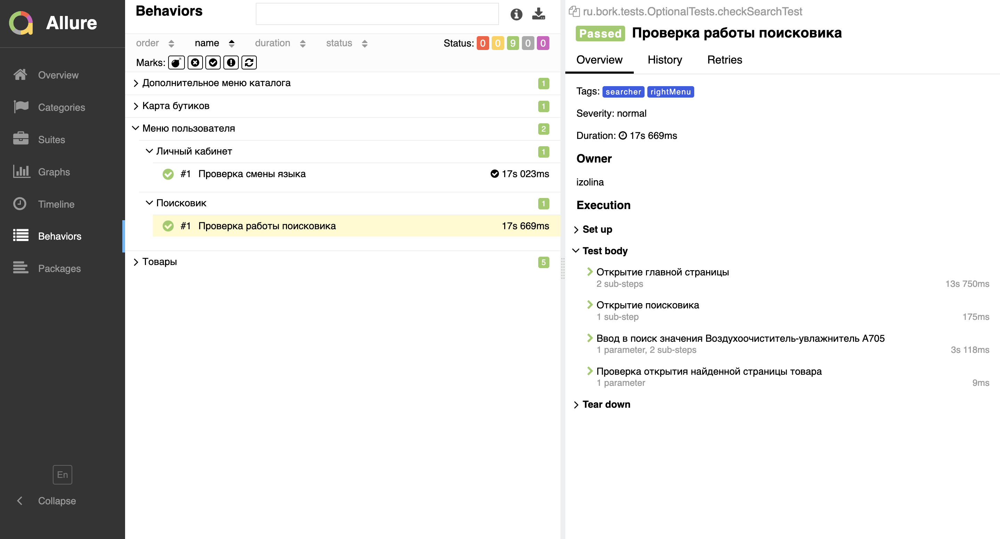
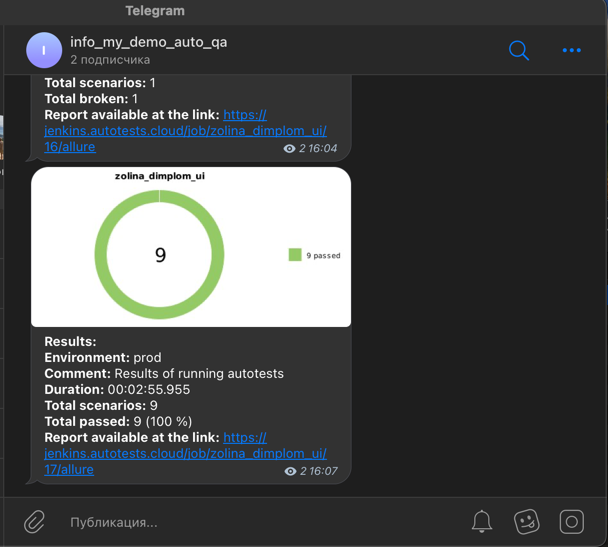

# Демо проект по автоматизации тестовых сценариев для магазина Bork

## **Содержание:**

- [Использованный стек технологий](#использованный-стек-технологий)
- [Запуск автотестов](#запуск-автотестов)
- [Сборка в Jenkins](#Сборка-в-Jenkins)
- [Пример Allure-отчета](#Пример-Allure-отчета)
- [Уведомления в Telegram с использованием бота](#Уведомления-в-Telegram-с-использованием-бота)
- [Видео примера запуска тестов в Selenoid](#Видео-примера-запуска-тестов-в-Selenoid)

## Использованный стек технологий

<p align="center">


</p>

- В данном проекте автотесты написаны на языке <code>Java</code> с использованием фреймворка Selenide для тестирования.
- В качестве сборщика был использован - <code>Gradle</code>.
- Использованы фреймворки <code>JUnit 5</code> и [Selenide](https://selenide.org/).
- При прогоне тестов браузер запускается в [Selenoid](https://aerokube.com/selenoid/).
- Для удаленного запуска реализована джоба в <code>Jenkins</code> с формированием Allure-отчета и отправкой результатов в <code>Telegram</code> при помощи бота.

## Содержание Allure-отчета:
* Шаги теста;
* Скриншот страницы на последнем шаге;
* Page Source;
* Логи браузерной консоли;
* Видео выполнения автотеста.

## Запуск автотестов

### Запуск тестов из терминала
```
gradle clean test
```
При выполнении команды, данные тесты запустятся удаленно в <code>Selenoid</code>.

При необходимости также можно переопределить параметры запуска

```
clean testByTags 
-Dtags=${TAG} 
-DbrowserName=${BROWSER}
-DbrowserSize=${BROWSER_SIZE}
-DremoteUrl=${REMOTE_URL}
```

### Параметры сборки

* <code>TAG</code> – тэг с которым будут запускаться тесты.
* <code>BROWSER</code> – браузер, в котором будут выполняться тесты. По-умолчанию - <code>chrome</code>.
* <code>BROWSER_SIZE</code> – размер окна браузера, в котором будут выполняться тесты.
* <code>REMOTE_URL</code> – адрес удаленного сервера, на котором будут запускаться тесты.

## Сборка в Jenkins
<p align="center">

</p>

##  Пример Allure-отчета
### Overview

<p align="center">

</p>

### Результат выполнения теста

<p align="center">

</p>

## Уведомления в Telegram с использованием бота

После завершения сборки, бот созданный в <code>Telegram</code>, автоматически обрабатывает и отправляет сообщение с результатом.

<p align="center">

</p>

## Видео примера запуска тестов в Selenoid

К каждому тесту в отчете прилагается видео прогона.
<p align="center">
  
</p>